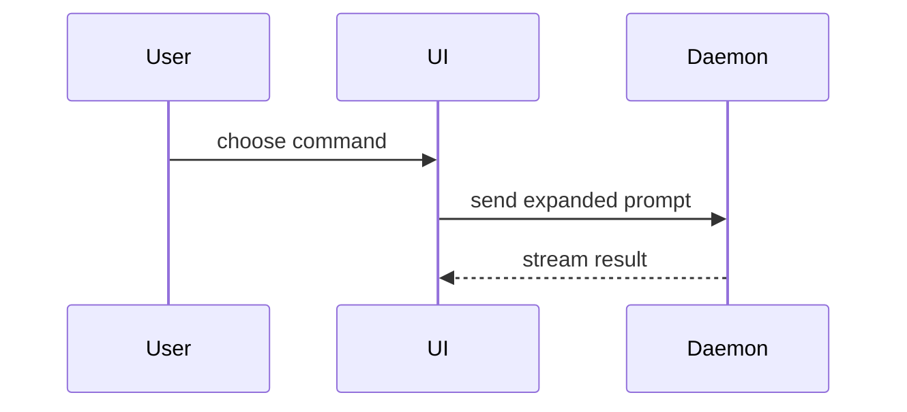

Use this template for the PR body:

```markdown
Fixes #<issue_number>   (or `Part of #<issue_number>`)

## Gist

<2–4 sentences>

<optional: one diagram, diff-sketch, or tree>

## Acceptance Criteria

<each criterion: met / partial / not addressed; clear or ambiguous>

## Evidence

- **Before:** <output/failing test run>
  **After:** <output/passing test run>

### Screenshots

<each image captioned with the acceptance criterion it proves, or "None — no visual change">

## Instructions

1. <steps for a reviewer to validate it themselves>

## Reversibility

**Undo:** <easy | costly | one-way>

<what undoing it takes once it is in production>

**Blast Radius:** <one word>

<who or what is hit if it is wrong, and how a failure shows up>
```

## Sections

Skip all preambles and keep prose brief. Most PR descriptions are too long for a human reviewer; write for one who reads only the Gist. Use the domain's nouns from
`CONTEXT.md`.

Each section answers one question:

| Section | Question |
|---|---|
| Gist | What is this, and what is the core data structure or migration, if any? If it is mostly UX, which objective does it serve? |
| Acceptance Criteria | Are the linked issue's criteria clear or ambiguous, and which does this diff meet? |
| Evidence | Is there solid proof that it works — and for UX, that the objective was achieved? |
| Instructions | How does a reviewer validate it independently? |
| Reversibility | What does undoing it take once deployed to production, and what is the blast radius? |

### Issue reference

Use `Fixes #N` when the diff satisfies the issue — not `Closes`. When it doesn't, use
`Part of #N` and say so in the Gist. Never a bare `#N`. The `VerifyIssue` CI check fails a
PR body with no issue mention.

### Gist

Name the core data structure or migration, or say there is none. Note whether the change
touches scripts, configuration rules, or dynamic forms — see
`docs/Checking-Dynamic-Content.md`.

Add a visual only when it makes the point faster than prose. Pick the smallest view that
makes the key point clear.

- Show logic or an algorithm as pseudocode:

```text
on(save)
  if content is unchanged
    return cached result
  write new content
  return fresh result
```

- Show runtime control flow as a call tree:

```text
submitForm
  createSession
    persistPrompt
    launchAgent
  navigateToSession
```

- Show UI structure as a component tree, including state and module boundaries that matter:

```text
<SessionPage> (apps/example/src/routes/session.tsx)
  useSessionEvents()
  <SessionToolbar>
    <RunSkillButton> (packages/ui)
```

- Show file responsibility or a broad refactor as a shallow file tree:

```text
src/
├── commands/       # parses user actions
├── sessions/       # owns session state
└── transport/      # sends API requests
```

- Show component interaction, control flow, or data flow with Mermaid:



- Use `diff` when the point is what changes and the surrounding shape already exists. Match
  the diff shape to the topic.

For a component change:

```diff
 <SessionPage>
   useSessionEvents()
   <SessionToolbar>
+    <RunSkillButton />
   <SessionTimeline>
+    <SkillResultCard />
```

For a file-layout change:

```diff
 src/
 ├── commands/
+│   └── show-me.ts       # expands the slash command
 ├── sessions/
-└── transport.ts
+└── transport/
+    ├── client.ts
+    └── stream.ts
```

For a call-tree or call-stack change:

```diff
 submitForm
   createSession
     persistPrompt
+    expandSkillMention
     launchAgent
-  navigateToSession
+  navigateToSession
+    subscribeToEvents
```

For a state or control-flow change:

```diff
 on(save)
-  write content
+  if content is unchanged
+    return cached result
+  write new content
+  invalidate cache
```

- Show the whole block when most of it is new, when omitted context would hide ownership or
  order, or when the user needs a copyable target shape:

```ts
function expandSkill(command: string): string {
  const skillName = command.slice(1);
  return `use the ${skillName} skill`;
}
```

Place each visual next to the short text it supports. Keep only the calls, files, props,
states, and boundaries needed to make the point. You may use one of these or several; it is
unlikely you will use all of them. Don't overwhelm the reviewer.

### Acceptance Criteria

Read the linked issue's body, not just its number. Mark each criterion met, partial, or not
addressed. Say plainly whether the criteria were clear or ambiguous, and how an ambiguity
was resolved.

### Evidence

Concrete proof, from the author, that the change works. Show a before and after.

Screenshots are S-tier — when the environment is set up for it and the change is visual.

Execution-based evidence is A-tier: test results, console output. Name the guarding spec
examples and show the run.

Paste only output you saw. A "before" needs a run you actually made; if the old behaviour
has no failing run, describe it in words.

#### Screenshots

The author's visual claim that the change is ready. Caption each image with the acceptance
criterion it proves; an image that proves no criterion does not belong. Show before and
after when the change alters something that already existed. Write "None — no visual
change" only when nothing visual changed — a UX change without screenshots is weak
evidence, and a reviewer will grade it that way. If possible, create screenshots to capture and attach them, but name it and pause for confirmation before running the browser.

### Instructions

How the reviewer validates it for themselves, independent of the Evidence. Numbered steps and what they should see when it works. When setup takes more than a minute of data entry, point to a paste-able console block in a PR comment rather than listing UI steps.

### Reversibility

Say what undoing the change takes once it is in production, as one of three values:

- **easy** — a revert, a feature flag, or a small follow-up fixes it. Notifications added for
  concierges who later want fewer is easy: change or disable the audience.
- **costly** — it can be undone, but deploying it is hard and backing it out is harder. A
  migration adding an index to a large table is costly: it needs a concurrent build going
  in, and another coming out.
- **one-way** — it cannot be undone: a migration that drops or rewrites data, a backfill,
  an email or inbox item already sent, an external system already notified. With a
  migration, treat it as one-way unless its `down` restores the data.

Name the value's cause in a sentence; a reviewer should not have to infer why.

The blast radius is the potential impact or scope of the change. Consider all
possibilities — who or what is hit if this is wrong, and how a failure would show up. List every deliberate behaviour change here, so a reviewer does not have to find it.

## Output

Read the `## Visual PR and review output` section of `CLAUDE.md` at the repo root:

```markdown
## Visual PR and review output
- Format: html (the .md is always kept)
- Location: tmp/reviews/pr-<n>/
```

- **Format** — `markdown` or `html`. Always write `visual-pr-body.md`; it is what goes to GitHub. With `html`, also render a preview beside it and open it: `python3 -I <this skill's base directory>/scripts/render_html.py <location>/visual-pr-body.md`.
- **Location** — the directory, with `<n>` the PR number. It must resolve inside a project directory, never the monorepo root. Before a PR exists, use the branch name for `<n>`.

If the section is missing, ask once for both values, offering `markdown` and
`tmp/reviews/pr-<n>/` as defaults. Then offer to add the section to `CLAUDE.md`,
and write it only on a yes. If they decline, use the answers for this run only.

## Writing to an existing PR

Write the body to the output location first and show the user. Run
`gh pr edit <n> --body-file …` only on approval.
